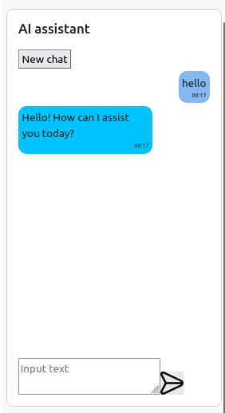

# ai assistant #

This plagin allow you to create a chat with the YandexGPT or GigaChat in the Moodle.
You will need a YandexCloud account and [API key](https://yandex.cloud/ru/docs/iam/concepts/authorization/api-key) to use YandexGPT or personal account with SberID and [Authorization key](https://developers.sber.ru/docs/ru/gigachat/quickstart/ind-using-api) to use GigaChat.  




# Block settings

The global block settings can be found by going to Site Administration > Plugins > Blocks > AI assistant settings. 
- **Heading**
- **Type AI** - Select YandexGPT or GigaChat
- **API key** - required parameter YandexGPT
- **Catalog ID**  - required parameter YandexGPT
- **Authorization key** - required parameter GigaChat
- **User request limit** - limit on the number of messages per day
- **Message length** - the maximum possible length of a single message
- **Course context** - transmit the following course information to the assistant. "You assistant in course: {course_name}  Description of course: {course_summary}"
- **Manage priorities** - you can set a higher priority for requests and they will be executed first

You also can set additional materials for a specific instance of the assistant: Edit mode > Three dots on top > Configure AI assistant block > Extra additional material.


## Installing via uploaded ZIP file ##

1. Log in to your Moodle site as an admin and go to _Site administration >
   Plugins > Install plugins_.
2. Upload the ZIP file with the plugin code. You should only be prompted to add
   extra details if your plugin type is not automatically detected.
3. Check the plugin validation report and finish the installation.

## Installing manually ##

The plugin can be also installed by putting the contents of this directory to

    {your/moodle/dirroot}/blocks/aiassistant

Afterwards, log in to your Moodle site as an admin and go to _Site administration >
Notifications_ to complete the installation.

Alternatively, you can run

    $ php admin/cli/upgrade.php

to complete the installation from the command line.

To use plagin you also need start /aiassistant/cli/worker.php.
To do this using the systemd:
1. Create file 
    /etc/systemd/system/moodle-ai-worker.service

and add to it

    [Unit]
    Description=Moodle AI Assistant Worker
    After=network.target mysql.service (your_server).service

    [Service]
    Type=simple
    User=www-data
    Group=www-data
    WorkingDirectory=(path_to_moodel)
    ExecStart=/usr/bin/php /path_to_moodle/blocks/aiassistant/cli/worker>
    Restart=always
    RestartSec=5
    StandardOutput=journal
    StandardError=journal

    [Install]
    WantedBy=multi-user.target
2.```
    sudo systemctl daemon-reload
    sudo systemctl start moodle-ai-worker.service
    sudo systemctl status moodle-ai-worker.service
 ```


## License ##

2025 Ekaterina Vasileva <kat.vus8@gmail.com>

This program is free software: you can redistribute it and/or modify it under
the terms of the GNU General Public License as published by the Free Software
Foundation, either version 3 of the License, or (at your option) any later
version.

This program is distributed in the hope that it will be useful, but WITHOUT ANY
WARRANTY; without even the implied warranty of MERCHANTABILITY or FITNESS FOR A
PARTICULAR PURPOSE.  See the GNU General Public License for more details.

You should have received a copy of the GNU General Public License along with
this program.  If not, see <https://www.gnu.org/licenses/>.
